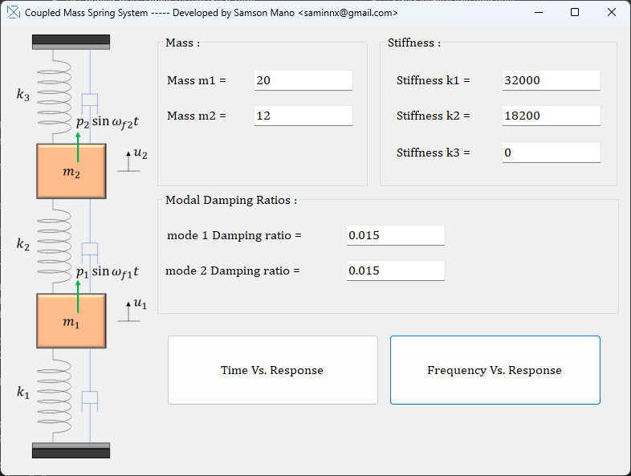
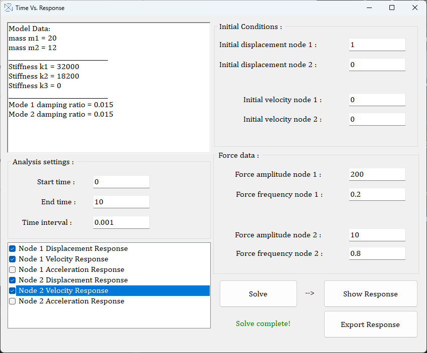
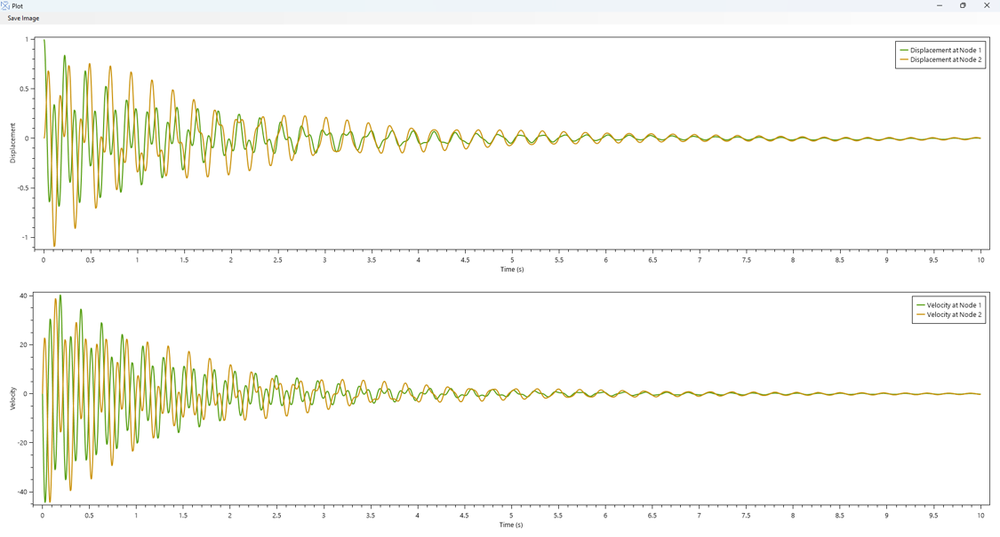
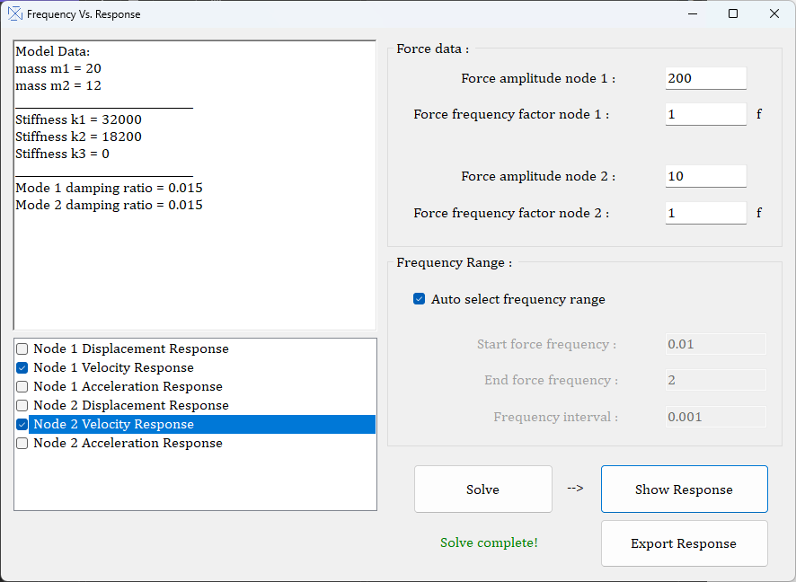
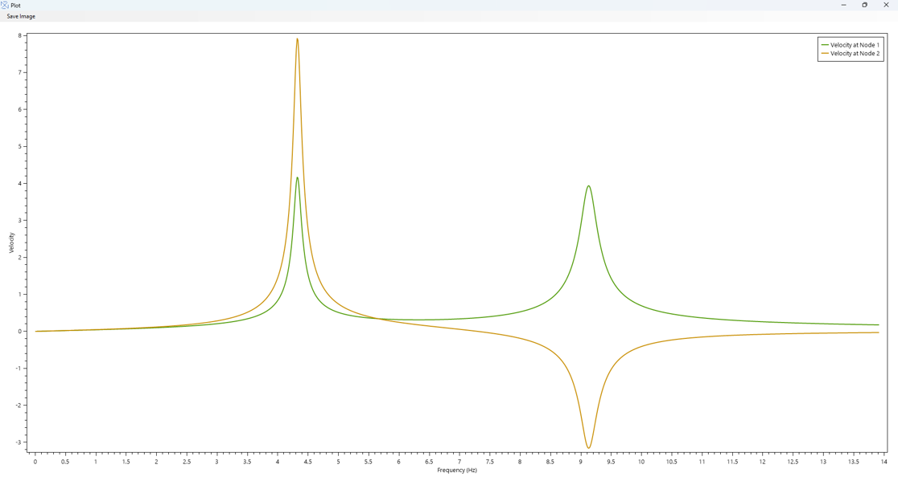

# Coupled Mass Spring System Dynamics Solver

**Coupled Mass Spring System Dynamics Solver** is a C# application designed to analyze the dynamic behavior of a two-degree-of-freedom (2 DOF) coupled mass-spring system. This software allows users to study the system's response to initial conditions, external sinusoidal forces, and damping effects, providing insights into both the transient and steady-state behavior of the system.

## Features

- **Time vs Response Analysis:**
  - Analyze how the system transitions from transient to steady state over time.
  - Observe the effects of initial displacements and velocities on the system's response.

- **Frequency Response Analysis:**
  - Explore the system's Dynamic Amplification Factor (DAF) or Response Amplitude Operator (RAO) by plotting the magnitude of displacement, velocity, and acceleration at node 1 or node 2.
  - Study the frequency response of the system across a range of forcing frequencies applied at either node.

- **Plotting and Exporting:**
  - Plot time vs response or frequency response curves.
  - Export results to a text file for further analysis.
  - Save plots as PNG images for easy sharing and documentation.

## User Interface

The application features a user-friendly interface that simplifies the setup and analysis process:

- **Input Parameters:**
  - Easily input mass values, stiffness coefficients, modal damping ratios, and other analysis settings.
  - Customize external forcing functions applied to either node 1 or node 2.

- **Interactive Plotting:**
  - Zoom in and out of plots using the scroll wheel.
  - Pan across plots by holding the right mouse button.
  - Double-click the middle mouse button to reset the view and fit the plot to the window.

## How to Use

1. **Clone or Download the Repository:**
   - Clone the repository using Git: 
     ```bash
     git clone https://github.com/yourusername/coupled-mass-spring-dynamics.git
     ```
   - Alternatively, download the ZIP file from the GitHub page and extract it.

2. **Run the Application:**
   - Download the portable version to run on any PC without needing to install additional software.
   - Execute the `CoupledMassSpringSolver.exe` to launch the application.

3. **Perform Analysis:**
   - Input the necessary parameters through the user interface.
   - Choose between time domain or frequency domain analysis.
   - Plot the results and export them as needed.

## Screenshots

Here are some screenshots to give you a better idea of the application's functionality:

- **Front Page of the Application:**
  
  

- **Time vs Response User Interface:**
  
  

- **Time vs Response Displacement and Velocity Plots:**
  
  

- **Frequency vs Response User Interface:**
  
  

- **Frequency vs Response Velocity Magnitude Plot:**
  
  

## License

This project is licensed under the MIT License. You are free to use, modify, and distribute this software as long as you include the original license in any substantial portions of the software.
